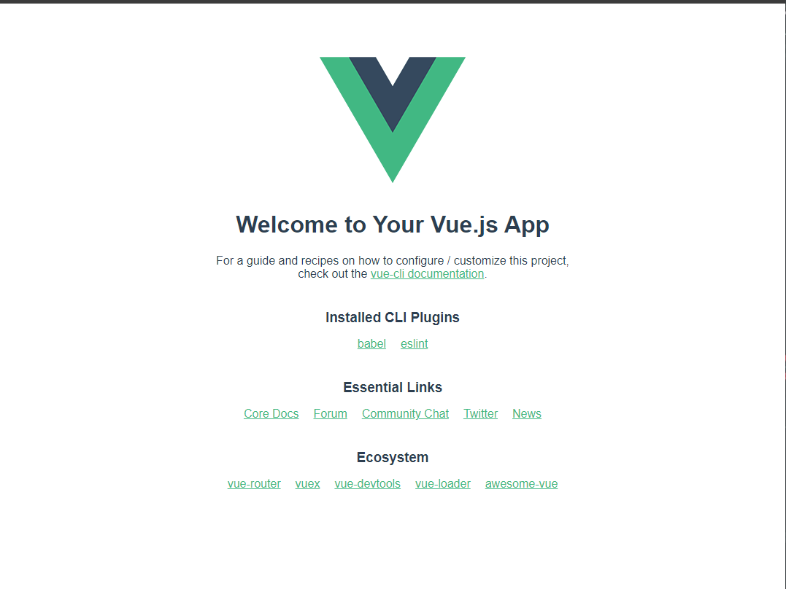

# Introduction To VueJS


## Objectives

- Learn how to install the Vue CLI
- Learn how to bootstrap a Vue project
- Learn how Vue apps are structured

## Prequisites

You must have the Vue devtools installed.

If you do not have the Vue browser devtools, you can install them from [Here](https://chrome.google.com/webstore/detail/vuejs-devtools/nhdogjmejiglipccpnnnanhbledajbpd?hl=en).

## Introduction

VueJS is a progressive and versatile Javascript `framework` that utilizes a templating engine to build fast and reactive web applications. Similar to React, it utilizes JSX but in an organized and declarative way. Vue follows a strict templating style that solves some of the organizational issues in React.

## Installing The Vue CLI

Let's start by installing the CLI. The Vue CLI allows us to start new Vue projects with minimal effort and configuration. It also allows us to run our Vue development servers.

Run the following command in your terminal:

```sh
npm i -g @vue/cli
```

Confirm that the CLI was successfully installed with:

```sh
vue --version
```

## Bootstrapping A Vue Project

Now that we have the CLI installed, we can now set up a Vue project.

In this repository, let's create our first Vue project.

Run the following in your terminal:

```sh
vue create first-vue-app
```

You'll now be prompted to select a version. Select the Vue 3 option with the `enter` key:

```sh
❯ Default ([Vue 3] babel, eslint)
```

Now sit back and wait for the CLI to finish setting up our project.

Once the CLI finishes setting up our project, enter the `first-vue-app` project and open it in vscode.

### Touring The Provided Structure

Let's start by taking a tour of our first Vue project. You'll notice the folder structure is very similar to React. We're provided both a `src` and `public` folder. The `src` folder will contain all of the code we write for our Vue projects.

Let's take look at the `main.js` file located in the `src` directory.

Let's analyze this file and understand how we combine the code from `src` with our `index.html` in the `public` folder.

```js
import { createApp } from 'vue'
import App from './App.vue'

createApp(App).mount('#app')
```

- We first destructure createApp from `vue` library
- We import the `App` component from `App.vue`. Note this file extension, we'll talk about that in a moment.
- `createApp` is called passing in `App` with the `mount` method specifying where to mount `App` (in the div with the id of 'app'). 


### The App Component

Let's take a look at the App component next and analyze the code provided:

```jsx
<template>
  <div id="app">
    
    <HelloWorld msg="Welcome to Your Vue.js App" />
  </div>
</template>

<script>
import HelloWorld from './components/HelloWorld.vue'

export default {
  name: 'App',
  components: {
    HelloWorld
  }
}
</script>

<style>
#app {
  font-family: Avenir, Helvetica, Arial, sans-serif;
  -webkit-font-smoothing: antialiased;
  -moz-osx-font-smoothing: grayscale;
  text-align: center;
  color: #2c3e50;
  margin-top: 60px;
}
</style>
```

We can see here that Vue utilizes a very declarative structure for it's components.

We start with the `<template></template>` tags. All of the code contained here is JSX. The code here is what get's rendered to the DOM at runtime.

Next we have a `<script></script>` tag. All of our Javascript get's written here. In the script section, we can import components, set up state and write methods to control our apps behavior.

Finally we have a `<style></style>` tag. Here we can write css for each component.

### Why use a template syntax?

By using this templating syntax, Vue ensures that any code written for a component stays with that component in other terms `binding` properties and data to a specific component.

### File Extensions

You'll notice that our `App` component utilizes a `.vue` extension. This extension allows us to utilize the templating syntax and any special Vue syntax. All components we write **must** utilize the `.vue` extension.

## Starting The Vue Server

Now that we've toured the provided code, let's see how Vue handles the development server.

Start your development servers with:

```sh
npm run serve
```

The browser will not open automatically with Vue however. In order to see our application head over to `http://localhost:8080` in your browser.

You should see the following page:



Welcome to your first Vue app!

## Recap

In this lesson we learned how to create and start a Vue app. VueJS utilizes a templating syntax that helps us as developers to organize and maintain our code in a structured way. Vue is quite strict with certain rules which we'll cover in a future lesson, but those rules help write code with less bugs and build much more performant applications that benefit our end users.

## Resources

- [Vue Docs](https://vuejs.org/)
- [Vue CLI Docs](https://cli.vuejs.org/)
- [Learn Vue](https://vuejs.org/v2/guide/)
